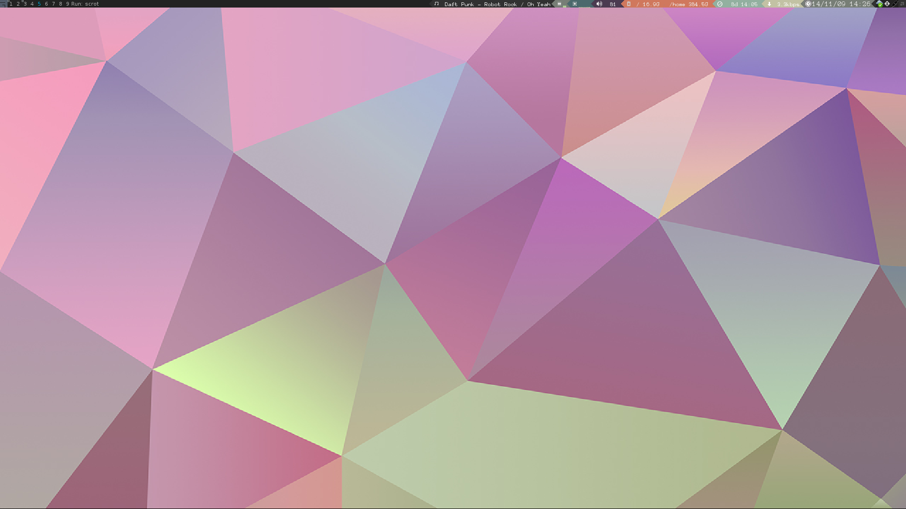

Awesome powerarrow-zev theme for 3.5
================================

This is a fork of   `esn89's powerarrowf theme <https://github.com/esn89/powerarrow>`_ which is  a fork of `romokee's powerarrow theme <https://github.com/romockee/powerarrow>`_ 

Installation
------------

 - Clone this repository with ``git clone --recursive https://github.com/kd8zev/powerarrow-zev.git`` in order to clone the `vicious <http://git.sysphere.org/vicious/>`_ repository if you do not have Awesome's vicious package installed.
 - Copy the contents of this repositoy to ``~/.config/awesome/``
 - Restart Asesome
 - You may need to edit rc.lua to have the names of the network devices and harddrives if your system is not set up the same way as mine - To change the wallpaper replace ``~/.config/awesome/themes/powerarrow-zev/wallpaper.jpg`` with your desired background.
 - To add/remove startup programs edit the last few lines (~line 650) of rc.lua
 - Change default programs (~line 50)
 - Enable/disable widgets by commenting/uncommenting ``right_layout:add(...)`` lines (~line 350)

Changes from esn89's theme
--------------------------

 - Changed keybindings back to Awesome defaults, added multimedia keys, and set Mod+Ctr+Tab to lock xscreensaver
 - Added MPD widget instead of gMail swidget
 - Changed mem and cpu widgets to graphs
 - Added uptime widget instead of battery level for desktop users
 - Added download icon to take the place of the wifi strength icons for non wifi devices
 - Changed back to default number of tags
 - Added the Awesome Icon and menu in front of the taglist to match default theme
 - Moved system tray to be between the clock and the layout
 - Re-organized the hierarchy of the repository

TODO
-------------------------------

- Adding a weather widget
- Looking to implement a calendar by turning the date
  textbox into a button

Screenshot
-------------------------------

